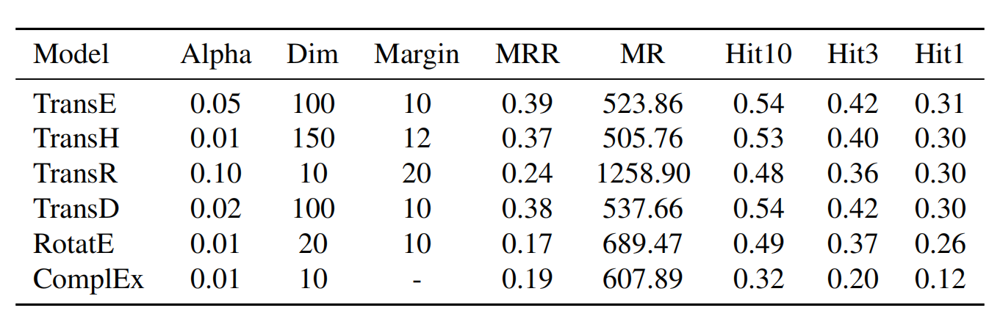

# Pesticide-Repurposing

The repository of study "Knowledge-Driven Pesticide Repurposing via link prediction with Pesticide Graph Embedding"

## Get start

### Dependencies

- CUDA 11.8
- Python 3.10 (or later)
- torch==2.4.0+cu118
- GNU Complier Collection >=8.1.0
- [OpenKE-Pytorch](http://139.129.163.161//)

### Data

The test data is [test2id](data/test2id.txt). The training set will be made public when the paper is accepted.

### Run

First, build the openke dynamic library

```bash
bash build.sh
```

Then, you can run the following command to train the model. Take TransE for example.

```bash
python main.py --model_name TransE --data_path data/ \
--opt_method Adam --alpha 0.001 --train_times 1000 \
--batch_size 1024 --use_gpu True --sampling_mode normal \
--save_path ckpt
```

Or you can run the following command to test the train ed model. Take TransE for example.

```bash
python main.py --model_name TransE --data_path data/ \
--use_gpu True --test True --load_path ckpt/TransE.ckpt
```

## Results

The results of KGE models in pesticide knowledge graph are shown in the following table.


